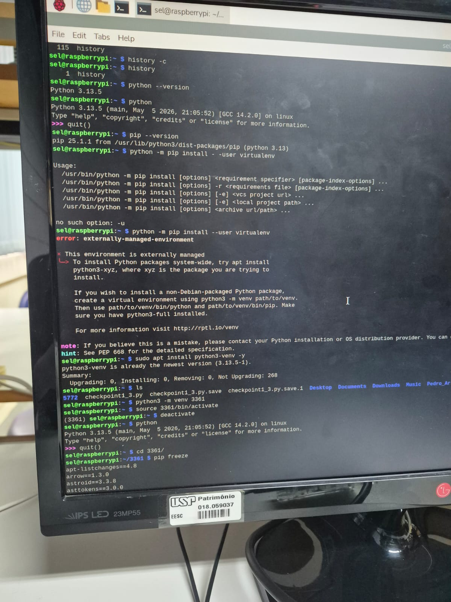
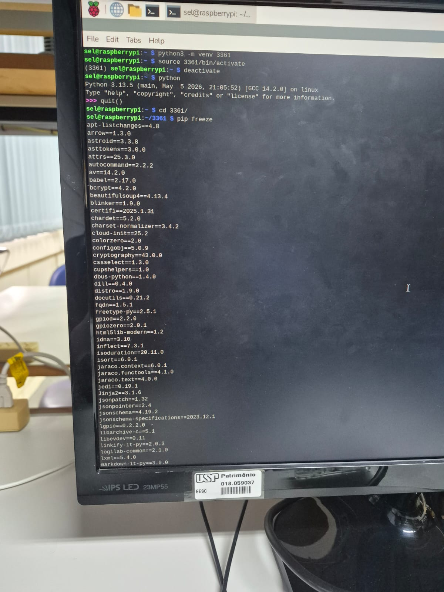
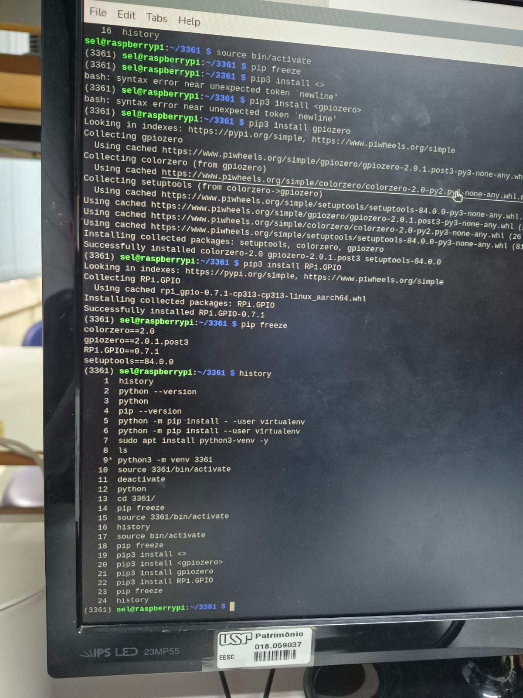
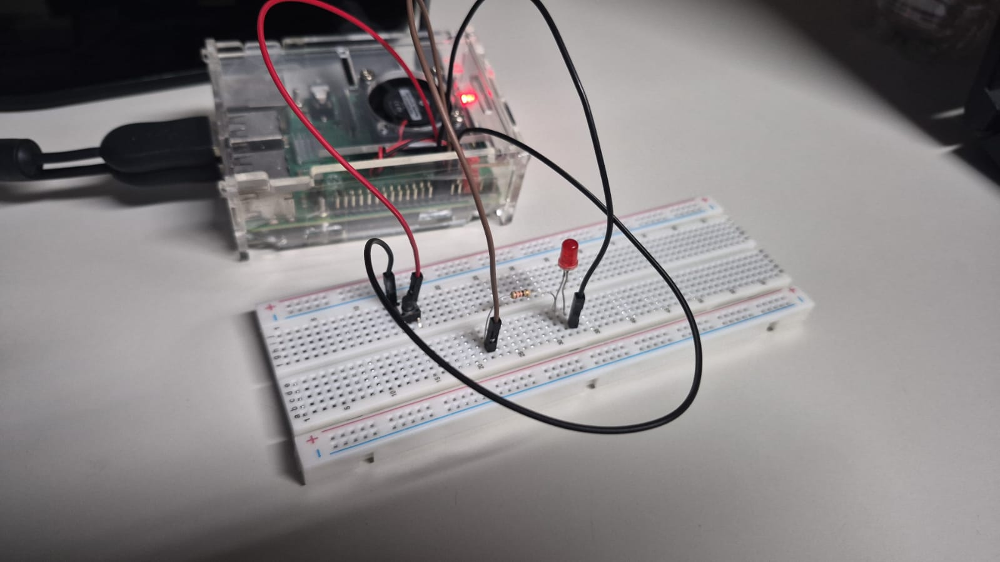
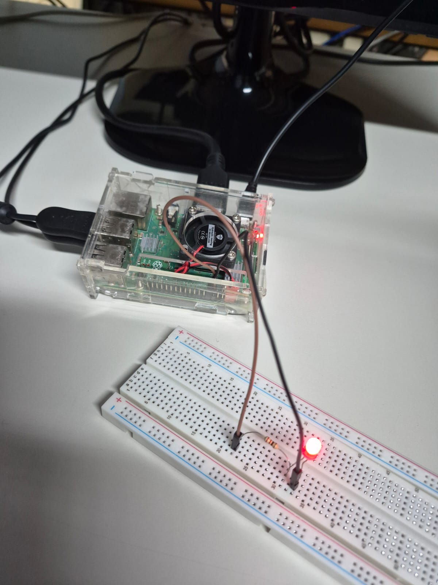
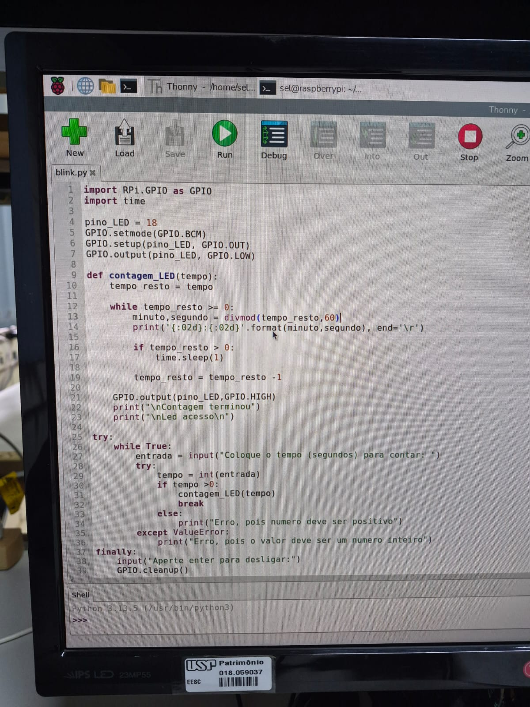
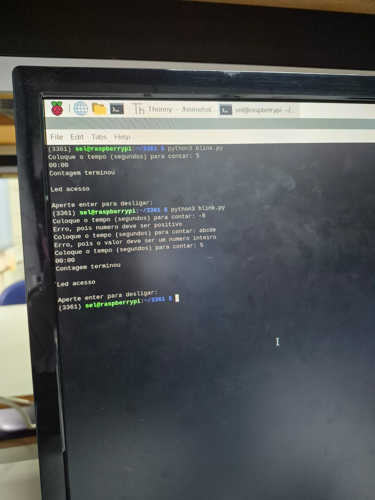
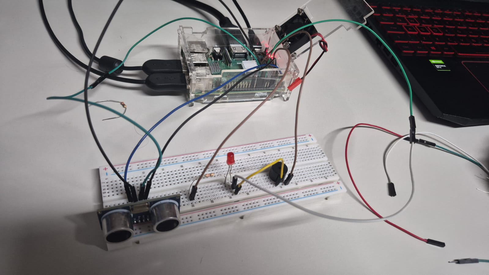

# SEL0337 — Projetos em Sistemas Embarcados
## Prática 3: Introdução à programação de alto nível com GPIO, Sensores, Periféricos e Computação Paralela
### Documentação Final (Checkpoints 1, 2 e 3)

**Integrantes:**
- Felipe Assis Bernardes Falvo — Nº USP: 15004433
- Kayke Malaquias Gregorio — Nº USP: 15651561

---

## 1. Introdução

A Prática 3 aplicou ideias de Python em sistemas embarcados, usando a Raspberry Pi para controlar hardware por meio dos pinos GPIO. Os pinos GPIO podem ser configurados como entradas ou saídas, permitindo ler botões e sensores e acionar LEDs e buzzers.

- **Checkpoint 1 — Ambiente virtual, LED com botão e contagem regressiva**
  - **Biblioteca:** `RPi.GPIO`
  - **Ideia:** criação e isolamento com ambiente virtual (`venv`), configuração de resistor de pull-up, detecção de eventos por borda, validação com type casting, tratamento de exceções (`try/except`) e modularização em funções.

- **Checkpoint 2 — PWM e sistema de proximidade com HC-SR04**
  - **Bibliotecas:** `RPi.GPIO` e `gpiozero`
  - **Ideia:** controle de duty cycle com PWM, verificação de sinal no osciloscópio, medição de distância com sensor ultrassônico e acionamento de LED e buzzer.

- **Checkpoint 3 — Threads, botão por interrupção e mutex**
  - **Bibliotecas:** `RPi.GPIO` e `threading`
  - **Conceitos:** execução concorrente com threads, interrupção externa com filtro debounce e sincronização com mutex (`Lock`).

---

## 2. Materiais e pinagem

**Materiais:** Raspberry Pi, protoboard, LEDs, resistores, botão (*push button*), buzzer, sensor ultrassônico HC-SR04, jumpers e osciloscópio.

**Mapeamento de Pinos e Componentes:**

- **Checkpoint 1 (Numeração BCM):**
  - **Botão (com pull-up):** GPIO 17
  - **LED da contagem regressiva:** GPIO 18

- **Checkpoint 2 (Numeração BCM):**
  - **LED do PWM:** GPIO 18
  - **Sensor HC-SR04 — Trigger:** GPIO 23
  - **Sensor HC-SR04 — Echo:** GPIO 24
  - **LED de alerta:** GPIO 14
  - **Buzzer:** GPIO 25

- **Checkpoint 3 (Numeração BOARD):**
  - **LED:** Pino 11 (GPIO 17)
  - **Botão (com pull-up):** Pino 13 (GPIO 27)

---

## 3. Checkpoint 1 — Ambiente virtual, GPIO básica e temporização

### 3.1 Ambiente virtual (`venv`)

Um ambiente virtual isola as bibliotecas de um projeto das instaladas no sistema, evitando conflitos. Foi criado o ambiente `3361`, formado pelos dois últimos dígitos do NUSP de cada integrante (`33` e `61`), e dentro dele foram instaladas as bibliotecas `gpiozero` e `RPi.GPIO`.

```bash
sudo apt install python3-venv -y
python3 -m venv 3361
source 3361/bin/activate
pip freeze
pip3 install gpiozero
pip3 install RPi.GPIO
pip freeze
deactivate
```

Ao tentar usar o `pip` no sistema, o Raspberry Pi OS retorna o erro `externally-managed-environment`, que protege os pacotes do sistema operacional. Esse erro e a comparação entre o `pip freeze` do sistema e o do `venv` estão nas imagens abaixo.

<table align="center">
  <tr>
    <td align="center"><br><sub>Erro externally-managed-environment</sub></td>
    <td align="center"><br><sub>pip freeze do sistema</sub></td>
    <td align="center"><br><sub>Histórico de comandos do venv</sub></td>
  </tr>
</table>

### 3.2 LED acionado por botão (`botao.py`)

**Objetivo:** acender o LED enquanto o botão estiver pressionado e apagar ele quando soltar o botão, usando detecção de eventos.

**Funcionamento:**
- O botão usa o resistor de pull-up (`GPIO.PUD_UP`). O pino fica em nível alto (`HIGH`) e vai a nível baixo (`LOW`) quando o botão é pressionado, pois ele conecta o pino ao GND.
- Em vez de polling (ler o pino em um laço), foi usada a detecção de eventos `GPIO.add_event_detect` nas duas bordas (`GPIO.BOTH`). Quando o estado muda, a função de callback `estado_led` é chamada.
- O programa para com `CTRL+C` devido ao `try/except KeyboardInterrupt`. Depois é usado o `GPIO.cleanup()`, que limpa as configurações dos pinos.

```python
def estado_led(canal):
    if GPIO.input(pino_botao) == GPIO.LOW:
        GPIO.output(pino_LED, GPIO.HIGH)
    else:
        GPIO.output(pino_LED, GPIO.LOW)

GPIO.add_event_detect(pino_botao, GPIO.BOTH, callback=estado_led)

try:
    print("Aperte CTRL+C para desligar")
    while True:
        time.sleep(1)
except KeyboardInterrupt:
    GPIO.cleanup()
```

<p align="center">
  <br>
  <sub>Montagem do botão e do LED (botão no GPIO 17 e GND)</sub>
</p>

**Vídeo de comprovação:** [`video_prova.mp4`](Pratica3_checkpoint_1/botao/video_prova.mp4). O video Mostra o LED acendendo ao apertar o botão e apagando ao soltar ele, mostrando a detecção de eventos por interrupção de borda (`GPIO.BOTH`).

### 3.3 Contagem regressiva com LED (`contagem_regressiva.py`)

**Objetivo:** o usuário coloca um tempo em segundos no terminal, e o programa faz a contagem regressiva e acende o LED.

**Funcionamento:**
- **Type casting:** a entrada é convertida para inteiro com `int()`.
- **Tratamento de exceções:** `try/except ValueError` avalia se a entrada não é numérica. Se o valor não for um inteiro, ou se não for positivo (`if tempo > 0`), o programa mostra o tipo de erro e pede a entrada novamente, sem desligar o programa.
- **Modularização:** a contagem está em uma função, `contagem_LED(tempo)`, que recebe o tempo já validado.
- **Formatação:** `divmod()` divide em minutos e segundos. O `end='\r'` faz a contagem atualizar na mesma linha.
- **Saída:** ao final, o GPIO 18 vai a nível alto e o LED acende. O `finally` aguarda um `ENTER` e executa `GPIO.cleanup()`.

```python
def contagem_LED(tempo):
    tempo_resto = tempo
    while tempo_resto >= 0:
        minuto, segundo = divmod(tempo_resto, 60)
        print('{:02d}:{:02d}'.format(minuto, segundo), end='\r')
        if tempo_resto > 0:
            time.sleep(1)
        tempo_resto = tempo_resto - 1
    GPIO.output(pino_LED, GPIO.HIGH)
    print("\nContagem terminou")
    print("Led aceso\n")

try:
    while True:
        entrada = input("Coloque o tempo (segundos) para contar: ")
        try:
            tempo = int(entrada)
            if tempo > 0:
                contagem_LED(tempo)
                break
            else:
                print("Erro, pois numero deve ser positivo")
        except ValueError:
            print("Erro, pois o valor deve ser um numero inteiro")
finally:
    input("Aperte enter para desligar: ")
    GPIO.cleanup()
```

<table align="center">
  <tr>
    <td align="center"><br><sub>Montagem do LED com resistor (GPIO 18)</sub></td>
    <td align="center"><br><sub>Código no Thonny, na Raspberry Pi</sub></td>
    <td align="center"><br><sub>Tratamento de entradas inválidas</sub></td>
  </tr>
</table>

**Vídeo de comprovação:** [`contagem_regressiva.mp4`](Pratica3_checkpoint_1/contagem_regressiva/contagem_regressiva.mp4). O video mostra a execução da contagem no terminal atualizando na mesma linha, a validação de tempo e o LED ligado no final.

### 3.4 Histórico de comandos

Os arquivos `historico_completo.txt` e `historico_contagem_14_08.txt` mostram os comandos do terminal usados nos dois dias de prática, desde a criação do ambiente `3361` e a primeira execução da contagem regressiva até o teste do programa do botão (`python3 botao.py`).

---

## 4. Checkpoint 2 — PWM e sistema de proximidade

### 4.1 PWM (`pwm.py`)

**Conceito:** o PWM gera um sinal cujo duty cycle define a fração do período em que o sinal fica em nível alto:

- **0%:** desligado;
- **50%:** nível alto durante metade do período;
- **100%:** ligado.

Em valores entre 0% e 100%, a carga recebe uma potência proporcional ao duty cycle, e o LED brilha com intensidade intermediária, sem que a tensão de alimentação seja reduzida. Isso pode ser importante, por exemplo, em motores, pois a redução de velocidade por PWM não reduz o torque.

**Implementação:** com `RPi.GPIO`, o GPIO 18 foi configurado como saída com PWM de 50 Hz. O duty cycle vai de 0% a 100% e desce de volta a 0%, em passos de 5%, com 0,5 s por passo. O `CTRL+C` encerra o PWM e executa `GPIO.cleanup()`.

```python
import RPi.GPIO as GPIO
import time

pino_LED = 18
GPIO.setmode(GPIO.BCM)
GPIO.setup(pino_LED, GPIO.OUT)

led_com_pwm = GPIO.PWM(pino_LED, 50)
led_com_pwm.start(0)

try:
    while True:
        for i in range(0, 101, 5):
            led_com_pwm.ChangeDutyCycle(i)
            time.sleep(0.5)
        for i in range(100, -1, -5):
            led_com_pwm.ChangeDutyCycle(i)
            time.sleep(0.5)
except:
    led_com_pwm.stop()
    GPIO.cleanup()
```

**Osciloscópio:** o sinal foi observado no osciloscópio. Com a frequência em 50 Hz, o período ficou em mais ou menos 20 ms e, ao mudar o duty cycle, verificou que apenas a largura do pulso variava.

**Vídeo de comprovação:** [`video_prova_pwm_led.mp4`](Pratica3_checkpoint_2/PWM_led/video_prova_pwm_led.mp4). O vide mostra o ciclo de subida e descida do brilho do LED junto com a forma de onda no osciloscópio.

### 4.2 Sistema de proximidade (`projeto.py`)

**Objetivo:** avisar quando um objeto estiver próximo, acionando um LED e um buzzer.

**O sensor HC-SR04** envia um pulso ultrassônico pelo pino *Trigger* e mede, no pino *Echo*, o tempo que o pulso leva para bater no objeto e voltar. A partir desse tempo é calculada a distância.

**Funcionamento:**
- Com `gpiozero`, o sensor é configurado por `DistanceSensor(echo=24, trigger=23, max_distance=2)`, com alcance de 2 m.
- A distância, fornecida em metros, é convertida para centímetros (`sensor.distance * 100`).
- Se a distância for **menor que 30 cm**, a função `ativar_alerta()` liga o LED e o buzzer. Caso contrário, `desativar_alerta()` desliga ambos.
- Ao pressionar `CTRL+C`, o programa desliga.

```python
from gpiozero import DistanceSensor, LED, Buzzer
import time

sensor = DistanceSensor(echo=24, trigger=23, max_distance=2)
led = LED(14)
buzzer = Buzzer(25)

def ativar_alerta():
    led.on()
    buzzer.on()

def desativar_alerta():
    led.off()
    buzzer.off()

try:
    while True:
        time.sleep(0.1)
        distancia_cm = sensor.distance * 100
        print(f"\rdistância :{distancia_cm:.1f} cm", end="", flush=True)

        if distancia_cm < 30:
            ativar_alerta()
        else:
            desativar_alerta()
except KeyboardInterrupt:
    desativar_alerta()
    print("\n")
```

<p align="center">
  <br>
  <sub>Montagem do sistema de proximidade (HC-SR04, LED e buzzer)</sub>
</p>

**Vídeo de comprovação:** [`video_prova.mp4`](Pratica3_checkpoint_2/projeto/video_prova.mp4). O vídeo mostra a aproximação de um obstáculo ao sensor HC-SR04, mostrando a leitura da distância no terminal e o LED e o buzzer ligando na distância menor que 30 cm.

---

## 5. Checkpoint 3 — Computação paralela e concorrência

### 5.1 Motivação:

Em um programa sequencial, uma função com laço, por exemplo, `while True` para piscar um LED, evita que qualquer tarefa seguinte seja executada. Em sistemas embarcados, é preciso manter uma atividade em andamento enquanto se verificam eventos, e não é plausível ficar parado em um `delay` sem poder fazer mais nada. A solução é a execução concorrente, com **threads** ou **processos**.


### 5.2 Aplicação desenvolvida

O programa é dividido em três partes principais, iniciando no modo lento com `tempo_pisca = 1`:

- **LED (pino 11):** controlado pela thread principal, responsável por piscar conforme o intervalo configurado.
- **Botão (pino 13):** acionado com a interrupção de hardware para mudar o tempo entre o modo lento (1s) e o modo rápido (0,2s).
- **Thread de contagem:** executa a contagem regressiva de 15 segundos em paralelo, exibindo no terminal o modo atual e o tempo restante.

**Estado inicial:** `tempo_pisca = 1`, ou seja, modo lento.

### 5.3 Botão por interrupção e *debounce*

O botão usa pull-up e interrupção na borda de descida, sem polling:

```python
GPIO.setup(botao, GPIO.IN, pull_up_down=GPIO.PUD_UP)

GPIO.add_event_detect(
    botao,
    GPIO.FALLING,
    callback=mudar_frequencia,
    bouncetime=300
)
```

O bouncetime de 300 ms evita seja lido vários cliques quando apertar o botão. Assim, a cada vez que foi apertado o botão é chamado `mudar_frequencia()`, que alterna o valor de `tempo_pisca` entre 1 s e 0,2 s.

### 5.4 Thread de contagem regressiva

```python
t_tempo = threading.Thread(
    target=thread_contagem,
    args=(15,)
)
t_tempo.start()
```

Dentro de `thread_contagem()`, `divmod(t, 60)` converte o tempo em minutos e segundos. A cada iteração, a função mostra o modo atual e o tempo restante. Enquanto isso, a thread principal continua piscando o LED, e as duas tarefas ocorrem de forma concorrente.

### 5.5 Mutex e condição de corrida

Como a variável tempo_pisca é usada em mais de um lugar ao mesmo tempo (o botão altera o seu valor, enquanto o LED e a contagem fazem a leitura), poderia ocorrer um problema onde uma parte fica tentando ler enquanto a outra fica atualizando o dado. Para evitar esse conflito e garantir que apenas uma tarefa mexa na variável de cada vez, foi utilizado um mutex:

```python
mutex = threading.Lock()

with mutex:
    tempo_atual = tempo_pisca

with mutex:
    opcao = "Opcao 1 (Lento)" if tempo_pisca == 1 else "Opcao 2 (Rapido)"
```

O `with mutex:` usa o lock ao entrar no bloco e o libera ele ao sair. Assim, apenas uma parte do programa acessa `tempo_pisca` por vez.


### 5.6 Controle do LED e encerramento

O LED é controlado pela thread principal, alternando o estado do pino entre ligado (`GPIO.HIGH`) e desligado (`GPIO.LOW`), aguardando o intervalo de cada estado:

- **Modo Lento:** o LED fica 1 segundo aceso e 1 segundo apagado.
- **Modo Rápido:** o LED fica 0,2 segundo aceso e 0,2 segundo apagado.

O programa usa a numeração dos pinos (**BOARD**) e encerra a execução chamando `GPIO.cleanup()`, o que limpa o estado das portas GPIO.

<p align="center">
  <br>
  <sub>Montagem do Checkpoint 3 (LED no pino 11 e botão no pino 13)</sub>
</p>

**Vídeo de comprovação:** [`video_prova_check3.mp4`](Pratica3_checkpoint_3/video_prova_check3.mp4). O video mostra a execução concorrente em tempo real, onde a thread secundária diminui a contagem de 15 segundos no terminal enquanto a thread principal deixa o LED piscando, com a possibilidade de mudar entre o Modo Lento (1 s) e Modo Rápido (0,2 s) ao pressionar o botão.


### 5.7 Conceitos de escalonamento e sincronização

- **Programa × processo:** um programa é um conjunto de instruções que fica em arquivo, no qual quando o sistema operacional o carrega e inicia, ele se torna um **processo**.
- **Thread:** menor unidade de execução de um processo. Um processo pode conter várias threads, todas compartilhando o mesmo espaço de memória.
- **Escalonamento:** mecanismo pelo qual o sistema operacional muda a execução entre threads ou processos por preempção, distribuindo parte de tempo de maneira circular.
- **Condição de corrida:** erro quando dois ou mais fluxos acessam e modificam um recurso compartilhado ao mesmo tempo sem coordenação, tornando o resultado não previsível.
- **Mutex:** sincronização que impõe a exclusão ao mesmo tempo, permitindo que apenas uma thread acesse o recurso compartilhado por vez.
- **Semáforo:** estrutura que permite que um número pré-definido de threads acesse ao mesmo tempo determinados recursos.
- **Deadlock:** travamento mútuo em que duas ou mais threads ficam bloqueadas, cada uma aguardando a liberação de um recurso que a outra está usando.
---

## 6. Multithreading vs. Multiprocessing

A principal diferença entre as duas abordagens está no gerenciamento de memória e no nível de isolamento das tarefas, pois enquanto as threads pertencem ao mesmo processo e usam o mesmo espaço de endereçamento na memória, os processos tem espaços de memória isolados e gerenciados pelo sistema operacional. Por usarem a mesma memória, a criação de threads e a troca de contexto são operações mais leves, permitindo a comunicação por meio de variáveis compartilhadas, desde que seja usado técnicas de sincronização como o mutex. 
Já os processos, eles precisam de mais custo de sistema e dependem de técnicas de comunicação interprocessos (como filas, *pipes* ou blocos de memória compartilhada), mas oferecem menos risco de falha e permitem paralelismo em diferentes núcleos da CPU, sendo melhor que as limitações do Global Interpreter Lock do Python.

No contexto do **Checkpoint 3**, a utilização de **threads** foi a opção mais direta. As duas atividades do programa, o LED piscando e a contagem regressiva, se baseiam em temporizações simples (`time.sleep`) e operações de entrada e saída, sem exigir cálculos pesados. Como a interrupção do botão precisa só atualizar a taxa de repetição do LED, o compartilhamento de memória permitiu que essa troca de informação ocorresse na variável `tempo_pisca`, mantendo a sincronização segura com um único mutex. A utilização de processos (`multiprocessing`), por outro lado, faria com que fosse necessário usar estruturas de IPC para transmitir esse valor de tempo entre tarefas.

---

### Arquivos dos Checkpoints

- **Checkpoint 1 — LED com botão:** [`botao.py`](Pratica3_checkpoint_1/botao/botao.py)
- **Checkpoint 1 — Contagem regressiva:** [`contagem_regressiva.py`](Pratica3_checkpoint_1/contagem_regressiva/contagem_regressiva.py)
- **Checkpoint 1 — Histórico de comandos:** [`historico_completo.txt`](Pratica3_checkpoint_1/historico_completo.txt)
- **Checkpoint 2 — PWM:** [`pwm.py`](Pratica3_checkpoint_2/PWM_led/pwm.py)
- **Checkpoint 2 — Aplicação com sensor:** [`projeto.py`](Pratica3_checkpoint_2/projeto/projeto.py)
- **Checkpoint 3 — Threads, botão e mutex:** [`checkpoint3.py`](Pratica3_checkpoint_3/checkpoint3.py)
